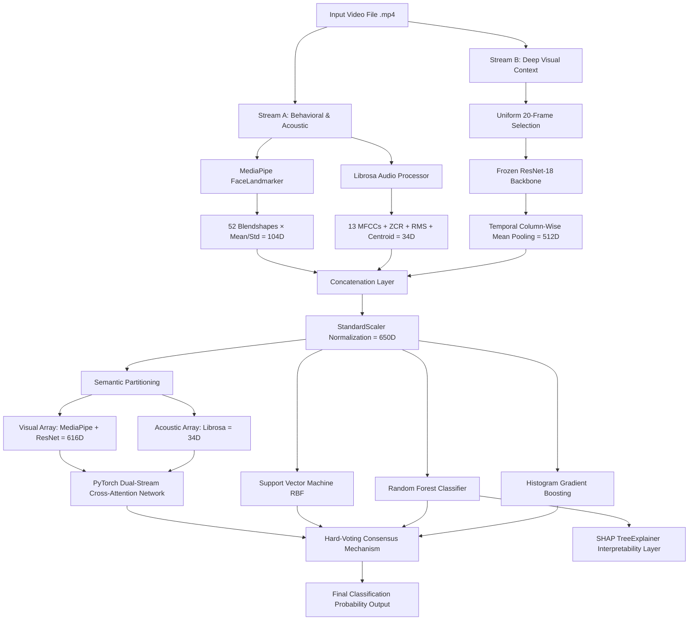

```markdown
# DeceptiLens: A Multimodal Ensemble Framework for Deception Detection

[](https://img.shields.io/badge/Architecture-Notes-blue?style=for-the-badge)
[](https://img.shields.io/badge/Academic-Report-orange?style=for-the-badge)

DeceptiLens is a production-grade multimodal machine learning framework designed to classify video assertions as truthful or deceptive. The system processes raw video inputs through isolated behavioral, acoustic, and deep spatial feature extraction pipelines, fusing them into a 650-dimensional joint vector. Classification is driven by a custom PyTorch Dual-Stream Cross-Attention network operating within a regularized, heterogeneous hard-voting ensemble.

Developed as part of a Senior Design Project at North South University, this framework moves past simple decision-level video fusion to learn structural cross-modal dependencies while enforcing strict CPU-deployable latency constraints.

---

## Core Architecture and Pipeline Design

The system maps inputs into two parallel streams before performing cross-modal attention and final ensemble classification. This modular approach ensures behavioral features are extracted with millisecond-level fidelity while preventing high-dimensional visual texturing from overwhelming low-dimensional acoustic descriptors.



---

## Technical Modality Specifications

### 1. Stream A: Behavioral Dynamics and Acoustic Prosody

Stream A acts as the core behavioral channel, extracting continuous tracking vectors from audio tracks and face meshes to capture micro-expression deviations and vocal stress indicators:

* **Facial Behavior**: Implemented using the MediaPipe Face Landmarker framework. The extraction pipeline captures 52 continuous, anatomically grounded facial blendshape coefficients across all frames. For a clip containing $N$ frames, the pipeline calculates the temporal mean $\mu$ and standard deviation $\sigma$ for each coefficient:

$$\mu = \frac{1}{N} \sum_{i=1}^{N} x_i, \quad \sigma = \sqrt{\frac{1}{N} \sum_{i=1}^{N} (x_i - \mu)^2}$$


This mapping captures absolute muscle contraction magnitudes along with rapid, micro-expression twitches, producing a 104-dimensional facial behavioral descriptor.
* **Acoustic Prosody**: The audio track is isolated at a native 16 kHz sampling rate via Librosa. The pipeline extracts 13 Mel-Frequency Cepstral Coefficients (MFCCs), Zero-Crossing Rate (ZCR), Root Mean Square (RMS) energy, and Spectral Centroid parameters. Aggregating these windowed acoustic arrays by their mean and standard deviation produces a 34-dimensional prosody vector.

### 2. Stream B: Deep Visual Embeddings

To capture macro-level context (e.g., scene composition, head orientation, body configuration), the pipeline runs a parallel deep spatial encoding loop:

* **Frame Selection**: The engine uniformly samples 20 frames across the video timeline, striking an empirical balance between processing throughput and signal density.
* **Spatial Feature Extraction**: Frames pass through a frozen ResNet-18 model stripped of its classification layer. Each frame yields a 512-dimensional continuous activation tensor from the global average pooling layer, generating an intermediate feature tensor $F \in \mathbb{R}^{20 \times 512}$.
* **Temporal Caching**: The tensor is compressed into a fixed 512-dimensional video-level token using column-wise mean temporal pooling:

$$v = \frac{1}{20} \sum_{j=1}^{20} F_{j, \cdot}$$


This design handles temporal variations without requiring the heavy GPU overhead of 3D-CNNs or Video Vision Transformers.

---

## Modeling and Fusion Mechanics

### 1. PyTorch Dual-Stream Cross-Attention Network

The neural framework processes feature arrays based on their native semantic categories. Visual variables (MediaPipe + ResNet, 616 dimensions) and acoustic features (Librosa, 34 dimensions) pass through separate linear layers to match a uniform hidden dimension $d_k = 512$.

```
Visual Path (616D) ──> Linear Layer ──> [B, 1, 512] ──┐ ──> Cross-Attention Module ──> Fusion Layer
                                                     ✕
Acoustic Path (34D) ─> Linear Layer ──> [B, 1, 512] ──┘ ──> Cross-Attention Module ──> Fusion Layer

```

* **Bidirectional Stacking**: The network maps ensembling tokens to a standard shape of `[Batch, 1, 512]` and processes them through Scaled Dot-Product Attention heads ($h = 4$):

$$\text{Attention}(Q, K, V) = \text{softmax}\left(\frac{QK^T}{\sqrt{d_k}}\right)V$$


* **Cross-Modal Exchange**: The head components interact simultaneously to model audio-visual alignment:

$$\text{Visual to Audio}: Q = v_{\text{encoded}}, \quad K = V = a_{\text{encoded}}$$


$$\text{Audio to Visual}: Q = a_{\text{encoded}}, \quad K = V = v_{\text{encoded}}$$


* **Residual Connections**: Cross-attended outputs merge back into their base projections to preserve independent unimodal information if cross-modal alignments show high variance:

$$v_{\text{fused}} = v_{\text{encoded}} + \text{MultiHead}_{V \rightarrow A}(v_{\text{encoded}}, a_{\text{encoded}}, a_{\text{encoded}})$$


$$a_{\text{fused}} = a_{\text{encoded}} + \text{MultiHead}_{A \rightarrow V}(a_{\text{encoded}}, v_{\text{encoded}}, v_{\text{encoded}})$$


The final outputs are concatenated into a joint 1024-dimensional tensor passed directly to the classification block.

### 2. Regularization and Optimization Strategies

To manage training on limited sample volumes (1,452 videos across the target corpus), the training environment implements a three-pronged regularization protocol:

* **Decoupled Weight Decay**: Optimization uses the AdamW algorithm ($\alpha = 1 \times 10^{-4}$, $\lambda = 1 \times 10^{-3}$) to prevent parameter explosion.
* **Target Label Smoothing**: Soft targets replace hard binary targets ($\epsilon = 0.1$) to prevent overconfident boundary optimization:

$$y^{\text{smooth}}_c = (1 - \epsilon) \cdot y_c + \frac{\epsilon}{C}$$


* **Dropout Profiles**: Dropout layers ($p = 0.4$) are integrated inside the linear projection sequences and the final Multi-Layer Perceptron block.

### 3. Heterogeneous Stacking Consensus

The final decision is reached via a hard-voting ensemble combining four distinct algorithmic paradigms:

1. **PyTorch Neural Attention Network**: Models complex cross-modal relationships.
2. **Support Vector Machine (SVM)**: Optimized via randomized grid search with an RBF kernel ($C = 5.0$, $\gamma = \text{scale}$).
3. **Random Forest (RF)**: Comprises 500 deep estimators constrained to a maximum depth of 15 using $\sqrt{\text{features}}$ splitting rules.
4. **Histogram Gradient Boosting (HGB)**: Implements localized continuous binning (255 bins, learning rate = 0.05, 500 iterations).

If a tie occurs, the ensemble defaults to the highest aggregated prediction probability across all four components.

---

## Performance Benchmarks

### 1. In-Domain Performance (DOLOS Dataset)

Evaluated on the held-out DOLOS test partition (218 clips) maintaining a stratified 53:47 class distribution. A 10-fold cross-validation stability check for the baseline feature scaling generated a mean accuracy of 81.27% ± 3.38%.

| Model Configuration | Test Accuracy | F1-Score | ROC-AUC |
| --- | --- | --- | --- |
| **PyTorch Dual-Stream Cross-Attention** | **82.11%** | **0.8446** | **0.8853** |
| Heterogeneous Hard-Voting Ensemble | 80.28% | 0.8230 | 0.8812 |
| Support Vector Machine (RBF Baseline) | 79.82% | 0.8211 | 0.8667 |
| Histogram Gradient Boosting (HGB) | 77.06% | 0.7967 | 0.8341 |
| Random Forest Classifier (RF) | 75.23% | 0.7874 | 0.8247 |

### 2. Feature Modality Ablation Analysis (5-Fold CV via SVM)

Ablation testing reveals that the ImageNet-pretrained spatial features provide the dominant classification signal, while behavioral and acoustic features provide minor, consistent improvements.

| Ablation Configuration | Feature Dimensions | 5-Fold CV Accuracy | Cumulative Performance Delta |
| --- | --- | --- | --- |
| **Full Multimodal Multitask Pipeline** | **650D** | **80.58%** | **Reference Baseline** |
| ResNet-18 Embeddings Only | 512D | 80.51% | -0.07% |
| Visual Arrays Only (No Audio) | 616D | 80.03% | -0.55% |
| Spatial + Acoustic (No MediaPipe) | 546D | 79.62% | -0.96% |
| MediaPipe Blendshapes Only | 104D | 66.53% | -14.05% |
| Librosa Acoustic Descriptors Only | 34D | 64.95% | -15.63% |

### 3. Cross-Domain Transferability Profiles

Cross-domain generalization testing evaluates the framework across unseen environments under a strict leave-one-domain-out evaluation protocol using the **DOLOS**, **Real-Life Trial (RLT)**, and **MDPE** datasets.

| Evaluated Multimodal System Configurations | RLT+DOLOS $\rightarrow$ MDPE | RLT+MDPE $\rightarrow$ DOLOS | DOLOS+MDPE $\rightarrow$ RLT | Unweighted Mean |
| --- | --- | --- | --- | --- |
| **Portfolio Model Selection Ensemble** | **62.56%** | **55.82%** | **66.94%** | **61.77%** |
| Upgraded Feature-Space Classifier v2 | 61.64% | 55.82% | 66.94% | 61.47% |
| Oracle Upper-Bound Reference Model | 62.56% | 55.58% | 61.98% | 60.04% |
| Ultra-Strong Stacked Ensemble Baseline | 58.64% | 50.31% | 59.50% | 56.15% |
| Final Target-Aware Fusion Model | 60.49% | 45.28% | 51.24% | 52.34% |

*Engineering Insight:* The transition from in-domain validation accuracy (82.11%) to generalized multi-source transfer settings (61.77%) highlights the ongoing challenge of cross-domain domain shifts in deception detection models.

---

## Explainable AI (XAI) Integration

To prevent opaque decision-making, the pipeline includes a structural interpretability layer using SHAP (SHapley Additive exPlanations) TreeExplainer modules applied to the ensemble's tree systems.

* **Global Attributions**: Analysis reveals that `MFCC-7 coefficient mean` represents the single most significant behavioral attribute. High variances in this coefficient push outputs toward the deceptive classification boundary, aligning with behavioral research correlating vocal resonance variations with high cognitive loads.
* **Distributed Attributions**: The explainability layer demonstrates that deceptive classifications are rarely driven by isolated facial tells. Instead, decisions are typically reached via the combined weight of many small variations across the ResNet and MediaPipe features.

---

## Quick Replication and Installation Guide

### Prerequisites

* Python 3.12 or higher
* Recommended: FFmpeg installed on system path for audio separation loops.

### 1. Clone Repository and Install Libraries

```bash
git clone [https://github.com/ssavi45/deceptilens-multimodal-deception-pipeline.git](https://github.com/ssavi45/deceptilens-multimodal-deception-pipeline.git)
cd deceptilens-multimodal-deception-pipeline

# Initialize virtual environment
python -m venv venv
source venv/bin/activate  # Windows: venv\Scripts\activate

# Install required packages
pip install --upgrade pip
pip install torch torchvision --index-url [https://download.pytorch.org/whl/cpu](https://download.pytorch.org/whl/cpu)
pip install opencv-python mediapipe librosa scikit-learn numpy pandas shap streamlit

```

### 2. Execute Local Inference Interface

The framework includes a CPU-optimized Streamlit dashboard for batch file testing and feature extraction validation:

```bash
streamlit run app.py

```

### 3. Project Directory Structure

```text
├── app.py                  # Streamlit frontend interface and inference engine
├── core/
│   ├── models.py           # PyTorch CrossAttention and residual networks
│   ├── extraction.py       # MediaPipe, Librosa, and ResNet feature parsers
│   └── fusion.py           # Scaling matrices and serialization loaders
├── weights/
│   ├── cross_attention.pth # Serialized deep network state dictionary
│   └── ensemble_ml.pkl     # Frozen classical model configurations
└── scripts/
    ├── train_primary.py    # In-domain optimization training execution scripts
    └── evaluate_domain.py  # Cross-domain benchmarking validation tasks

```

---

## Credits and Citation

This framework was designed and implemented by **Shoumik Sarkar**, and **Sumon Das**, under the supervision of **Dr. Sifat Momen** (Professor within the ECE Department at North South University).

### Project Citations

```r
@techreport{sarkar2026deceptilens,
  author      = {Shoumik Sarkar, Sumon Das},
  title       = {DeceptiLens: A Multimodal Ensemble Framework for Deception Detection Using Behavioral Features and Deep Visual Embeddings with Cross-Domain Evaluation},
  institution = {North South University, Department of Electrical and Computer Engineering},
  year        = {2026},
  type        = {Senior Design Project}
}

```

```

```
